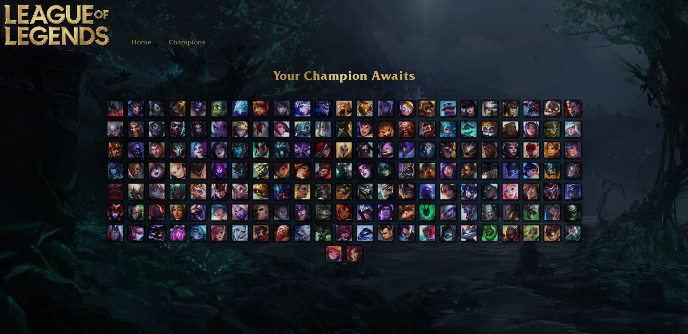
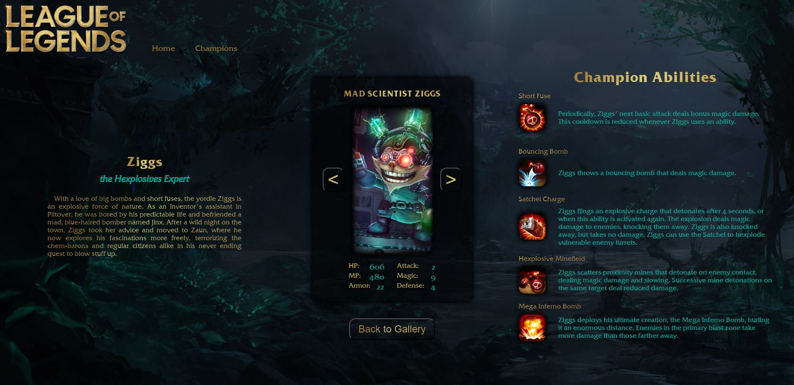

# League of Legends API

 

## Live Deployment: https://lol-api-fan-page.vercel.app/
 

### I love this API from RIOT games (no api key needed).
Docs: https://developer.riotgames.com/docs/lol#data-dragon_champions  
Endpoint: http://ddragon.leagueoflegends.com/cdn/13.12.1/data/en_US/champion.json

## *Description*
This is a fan page for the game League of Legends. It uses the Riot Games API to pull data from the game and display it on the page. The project was built with Vite (React) and is deployed on Vercel.

 
 

## Choose from 163 champions to view their stats, lore, and skins.

 
 

## See the skins for each champion along with a lore story and a description of their abilities.

 

## *Questions*
<h3>Portfolio:&emsp;<a href="https://jk377y.dev" target="_blank">https://jk377y.dev</a></h3>
<h3>Email:&emsp;<a href="mailto:jk377y@gmail.com" target="_blank">jk377y@gmail.com</a></h3>
<h3>LinkedIn:&emsp;<a href="https://www.linkedin.com/in/james-kelly-software-developer/" target="_blank">https://www.linkedin.com/in/james-kelly-software-developer/</a></h3>
<h3>GitHub:&emsp;<a href="https://github.com/jk377y" target="_blank">https://github.com/jk377y</a></h3>
 

## *License*

 Copyright (c) 2023 James Kelly
 Information on this license can be found at: (https://opensource.org/licenses/MIT)
 
 
## *Credits*
RIOT GAMES - https://www.riotgames.com/en
 
&emsp; - League of Legends - https://www.leagueoflegends.com/en-us/?utm_medium=card1%2Bwww.riotgames.com&utm_source=riotbar
 
<h2>This application is not endorsed by Riot Games and does not reflect the views or opinions of Riot Games or anyone officially involved in producing or managing Riot Games properties. Riot Games and all associated properties are trademarks or registered trademarks of Riot Games, Inc</h2>